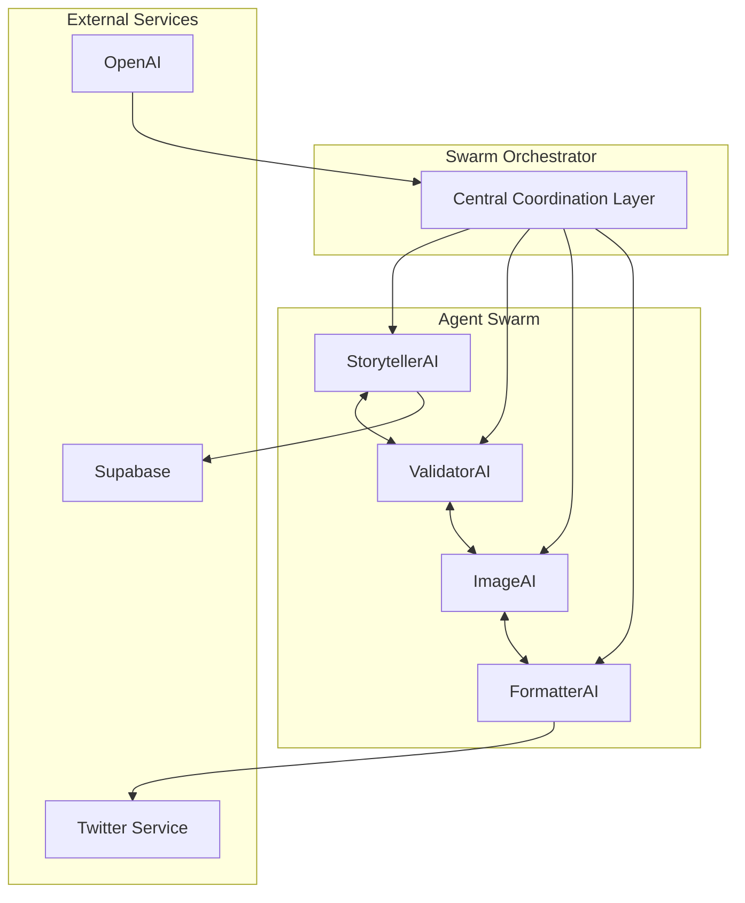

# 🤖 SolQuestAI

Page description (optional)

# SolQuestAI System Documentation

## Overview

SolQuestAI is a sophisticated swarm-based AI system that creates interactive D&D adventures with a Web3 twist. The system orchestrates a swarm of specialized AI agents working in concert, combining advanced language models, social media integration, and blockchain concepts to deliver an engaging storytelling experience.

## Swarm Architecture

### Agent Swarm
- **StorytellerAI**: Generates immersive D&D narratives with skill checks and choices
- **ValidatorAI**: Ensures content quality and theme consistency
- **ImageAI**: Creates detailed visual prompts for scene visualization
- **FormatterAI**: Optimizes content for social media platforms

Each agent in the swarm operates autonomously while maintaining constant communication and coordination through the Swarm Orchestrator.

## Core Components

- Real-time community participation through Twitter polls
- Dynamic story adaptation based on collective choices
- Integrated D&D mechanics with skill checks
- Branching narratives with meaningful consequences

## Web3 Integration
- Crypto concepts reimagined in a fantasy setting
- Blockchain-inspired story elements
- Community-driven narrative development

## Quality Assurance
- Swarm-based content validation
- Multi-agent theme consistency checking
- Distributed format verification
- Collective ethical alignment validation

## Social Media Integration
- Twitter-optimized formatting
- Automated poll creation
- Media generation and posting
- Thread management

## System Flow

